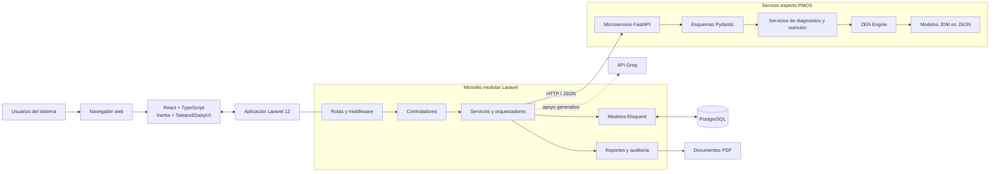
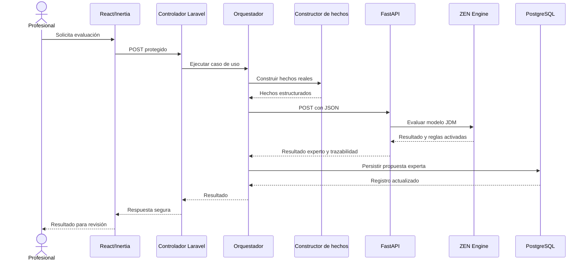

# Arquitectura y patrones del sistema

## 1. Introducción

El sistema fue construido como una solución web distribuida para apoyar el diagnóstico endocrinológico de PMOS y resistencia a la insulina, la orientación nutricional, la planificación alimentaria y el seguimiento de pacientes. La solución combina un núcleo transaccional desarrollado en Laravel con un microservicio especializado en inferencia mediante FastAPI y ZEN Engine.

La definición más precisa de su arquitectura es:

> **Arquitectura cliente-servidor distribuida, compuesta por un monolito modular Laravel organizado en capas y un microservicio especializado de sistema experto.**

En el núcleo Laravel se aplica principalmente el patrón **MVC extendido con una capa de servicios**. El microservicio Python aplica una organización por **routers, esquemas y servicios**, y encapsula el motor de reglas basado en modelos JDM.

## 2. Estilo arquitectónico general

### 2.1. Arquitectura cliente-servidor

Los usuarios acceden al sistema desde un navegador web. La interfaz React envía solicitudes al servidor Laravel, el cual autentica al usuario, aplica autorización por roles, ejecuta los casos de uso y accede a la base de datos.

Los clientes principales son:

- administrador;
- endocrinólogo;
- nutricionista;
- paciente.

Laravel actúa como servidor principal y es responsable de la lógica transaccional, seguridad, persistencia, auditoría, reportes y entrega de las páginas mediante Inertia.

### 2.2. Monolito modular

La mayor parte de la solución reside en una sola aplicación Laravel y se despliega como una unidad. Sin embargo, el código está separado funcionalmente en módulos como:

- administración;
- autenticación y control de acceso;
- endocrinología;
- nutrición;
- sistema experto;
- seguimiento del paciente;
- notificaciones;
- reportes y auditoría.

Por ello, el núcleo no es un monolito desorganizado, sino un **monolito modular**. Los controladores y servicios se agrupan por responsabilidad funcional, lo que reduce el acoplamiento entre módulos y facilita su mantenimiento.

### 2.3. Componente distribuido especializado

El sistema experto se ejecuta fuera del proceso Laravel, en el microservicio `pmos-experto`. Laravel se comunica con este servicio mediante HTTP y JSON.

El microservicio contiene:

- FastAPI como interfaz HTTP;
- routers para exponer los casos de evaluación;
- esquemas Pydantic para validar entradas y salidas;
- servicios de PMOS, RI y nutrición;
- ZEN Engine como motor de decisiones;
- modelos JDM en archivos JSON.

Esta separación permite aislar la tecnología de inferencia del sistema clínico principal. No obstante, como solo la inferencia está separada, la solución no debe describirse como una arquitectura completa de microservicios, sino como una **arquitectura híbrida con un microservicio especializado**.

## 3. Patrón arquitectónico principal: MVC extendido

Laravel implementa el patrón Modelo–Vista–Controlador, adaptado al uso de React e Inertia.

### 3.1. Modelo

Los modelos Eloquent representan las entidades persistentes, sus relaciones, conversiones de datos y operaciones sobre PostgreSQL. Entre ellos se encuentran pacientes, diagnósticos, evaluaciones, recomendaciones, recetas, planes y seguimientos.

El proyecto utiliza el patrón **Active Record**, porque cada modelo Eloquent representa una tabla y proporciona operaciones para consultar y modificar sus registros.

### 3.2. Vista

La presentación se implementa mediante:

- React y TypeScript;
- páginas y componentes reutilizables;
- Inertia.js como puente entre Laravel y React;
- Tailwind CSS y DaisyUI para estilos.

Inertia permite mantener rutas y controladores Laravel sin construir una API REST separada para toda la interfaz. El controlador entrega el nombre de la página y sus propiedades, y React se encarga de representarlas en el navegador.

### 3.3. Controlador

Los controladores reciben las solicitudes HTTP, validan o delegan su validación, verifican el contexto de acceso, invocan los servicios correspondientes y retornan respuestas Inertia, JSON, redirecciones o archivos PDF.

Los controladores se mantienen orientados a coordinar la solicitud y no deberían concentrar reglas clínicas o cálculos extensos.

### 3.4. Extensión mediante capa de servicios

El MVC del proyecto se extiende con una **Service Layer** o capa de servicios. Esta capa concentra casos de uso y operaciones que no corresponden directamente a una vista, controlador o modelo.

Ejemplos existentes:

- construcción de hechos clínicos y nutricionales;
- orquestación del sistema experto;
- persistencia de resultados expertos;
- generación de planes semanales;
- clasificación y ranking de recetas;
- evaluación de elegibilidad nutricional;
- seguimiento, analítica y reportes;
- copias de seguridad y auditoría.

Esta separación evita duplicar lógica entre controladores, comandos y pruebas.

## 4. Organización por capas

La aplicación puede documentarse mediante las siguientes capas lógicas:

| Capa | Componentes | Responsabilidad |
|---|---|---|
| Presentación | React, TypeScript, páginas, componentes, Tailwind y DaisyUI | Interacción visual con cada rol. |
| Entrada web | Rutas, middleware, controladores y Form Requests | Recepción de solicitudes, autenticación, autorización y validación. |
| Aplicación | Servicios y orquestadores Laravel | Ejecución de casos de uso y coordinación del flujo. |
| Dominio clínico y nutricional | Reglas de elegibilidad, cálculos, construcción de hechos, clasificación y planificación | Decisiones y procesos propios del problema. |
| Persistencia | Modelos Eloquent y PostgreSQL | Almacenamiento, consulta, relaciones y trazabilidad. |
| Integración | Laravel HTTP Client, cliente compatible con OpenAI/Groq y Dompdf | Comunicación con servicios externos y generación documental. |
| Inferencia experta | FastAPI, Pydantic, servicios Python, ZEN Engine y JDM | Evaluación determinista de reglas PMOS, RI y nutrición. |

Las capas son lógicas y no implican aislamiento absoluto. El proyecto no implementa formalmente puertos y adaptadores, por lo que no debe clasificarse como arquitectura hexagonal pura.

## 5. Patrones de diseño identificados

### 5.1. Service Layer

Los servicios encapsulan casos de uso complejos y ofrecen operaciones reutilizables a controladores, comandos y otros servicios.

### 5.2. Orquestador

Los orquestadores coordinan varias etapas de un proceso. En la evaluación experta, por ejemplo, coordinan:

1. recuperación del diagnóstico o paciente;
2. construcción de hechos;
3. llamada al microservicio;
4. recepción del resultado;
5. persistencia controlada;
6. devolución del modelo actualizado.

Este patrón aparece en `OrquestadorSistemaExpertoService` y `OrquestadorNutricionalExpertoService`.

### 5.3. Active Record

Eloquent implementa Active Record: las entidades contienen el mapeo a tablas, relaciones y operaciones de persistencia. Por esta razón no se observa una capa Repository general para abstraer todos los modelos.

### 5.4. Dependency Injection

Laravel resuelve servicios y dependencias mediante su contenedor. Los servicios reciben colaboradores en sus constructores, lo cual facilita sustituirlos por mocks o respuestas simuladas durante las pruebas.

### 5.5. DTO y validación de contratos

En Laravel, los arreglos validados y las respuestas estructuradas actúan como contratos de intercambio. En FastAPI, los esquemas Pydantic cumplen una función equivalente a DTO: definen la forma y los tipos de entrada y salida.

### 5.6. API Gateway interno o fachada de integración

`SistemaExpertoZenService` funciona como una **fachada de integración** para Laravel. Centraliza la URL base, timeout, solicitudes HTTP, validación de respuestas y errores del microservicio, evitando que cada módulo conozca los detalles de FastAPI.

No constituye un API Gateway de infraestructura independiente; es una fachada interna de aplicación.

### 5.7. Rule Engine

ZEN Engine ejecuta reglas declarativas almacenadas como modelos JDM. El conocimiento queda separado del flujo general de Laravel y puede representarse mediante condiciones y decisiones del tipo:

> SI se cumplen determinados hechos clínicos, ENTONCES se obtiene una conclusión y su trazabilidad.

Este enfoque es determinista y explicable: ante los mismos hechos y la misma versión de reglas debe producirse el mismo resultado.

### 5.8. Strategy con degradación controlada

La selección de recetas combina una estrategia determinista con un ranking complementario mediante Groq. Si el proveedor generativo falla, el sistema conserva el orden determinista y evita interrumpir la planificación. La IA generativa actúa como apoyo y no reemplaza las reglas clínicas.

### 5.9. Middleware y control de acceso por roles

La autenticación, verificación de correo y autorización se aplican transversalmente mediante middleware. Las rutas se agrupan por los roles `administrador`, `endocrinologo`, `nutricionista` y `paciente`.

### 5.10. Observer o registro transversal de actividad

La aplicación registra actividad y accesos para auditoría. Este comportamiento es transversal al negocio y permite identificar usuarios, acciones y cambios sin mezclar la presentación con la trazabilidad.

## 6. Diagrama de arquitectura lógica

## 7. Arquitectura física o de despliegue

En el entorno actual, la solución está compuesta por los siguientes procesos:

1. navegador del usuario;
2. servidor frontend Vite durante desarrollo o recursos compilados en producción;
3. servidor Laravel/PHP;
4. servidor PostgreSQL;
5. proceso FastAPI/Python en el puerto configurado, normalmente `8001`;
6. servicios externos opcionales, como Google OAuth y Groq.

Aunque Laravel y FastAPI puedan ejecutarse inicialmente en el mismo equipo, se comunican mediante una interfaz HTTP. Por ello pueden desplegarse de manera independiente posteriormente.

## 8. Flujo de evaluación mediante el sistema experto

La validación profesional se realiza después de la inferencia. El resultado del motor se conserva como propuesta trazable y no sustituye automáticamente la decisión médica o nutricional.

## 9. Flujo general de datos

El flujo principal puede resumirse así:

1. el usuario se autentica;
2. el middleware verifica sesión, correo y rol;
3. React/Inertia envía la operación a una ruta Laravel;
4. el controlador delega el caso de uso a un servicio;
5. el servicio consulta o actualiza modelos Eloquent;
6. si requiere inferencia, Laravel construye hechos y llama a FastAPI;
7. ZEN Engine evalúa el modelo JDM;
8. Laravel recibe y persiste resultado y trazabilidad;
9. el profesional valida, corrige o rechaza la propuesta;
10. la interfaz muestra el estado actualizado y permite generar reportes.

## 10. Justificación de la arquitectura seleccionada

La arquitectura resulta adecuada para el proyecto por las siguientes razones:

- Laravel centraliza seguridad, reglas transaccionales, persistencia y módulos de usuario.
- El monolito modular reduce complejidad operativa frente a separar prematuramente todos los módulos.
- La capa de servicios evita controladores sobrecargados y permite reutilizar casos de uso.
- FastAPI aísla el motor experto y sus dependencias Python.
- Los contratos JSON desacoplan parcialmente Laravel del motor de reglas.
- Los modelos JDM facilitan la explicación y versionado del conocimiento experto.
- React e Inertia proporcionan una interfaz dinámica sin mantener dos aplicaciones web completamente independientes.
- PostgreSQL mantiene integridad relacional y trazabilidad clínica.
- La degradación controlada de Groq evita que una dependencia generativa comprometa el flujo principal.

## 11. Clasificación resumida para el informe

| Pregunta | Respuesta recomendada |
|---|---|
| ¿Cuál es la arquitectura general? | Cliente-servidor distribuida e híbrida. |
| ¿Cómo está construido el núcleo? | Monolito modular Laravel. |
| ¿Cuál es el patrón principal del backend? | MVC extendido con capa de servicios. |
| ¿Cómo persiste los datos? | Eloquent mediante Active Record sobre PostgreSQL. |
| ¿Cómo se integra el motor experto? | Microservicio FastAPI consumido mediante HTTP/JSON. |
| ¿Cómo se organiza FastAPI? | Routers, esquemas Pydantic y servicios. |
| ¿Qué patrón coordina la inferencia? | Orquestador más fachada de integración. |
| ¿Qué paradigma usa el conocimiento experto? | Motor de reglas declarativas SI–ENTONCES representadas en JDM. |
| ¿Es una arquitectura de microservicios? | No completamente; es un monolito modular con un microservicio especializado. |
| ¿Es arquitectura hexagonal o Clean Architecture pura? | No; presenta separación por capas, pero mantiene dependencias directas con Laravel y Eloquent. |

## 12. Conclusión

El proyecto adopta una arquitectura pragmática que combina la solidez transaccional de Laravel con la especialización de un servicio Python para inferencia. Su patrón predominante es **MVC con capa de servicios dentro de un monolito modular**, complementado por patrones de orquestación, fachada de integración, inyección de dependencias, Active Record y motor de reglas.

Esta arquitectura permite mantener en Laravel el expediente, la seguridad y las decisiones profesionales, mientras ZEN Engine se limita a producir recomendaciones explicables a partir de hechos estructurados. La división respeta el principio fundamental del sistema: la tecnología apoya la decisión, pero la validación final permanece bajo responsabilidad del profesional de salud.
